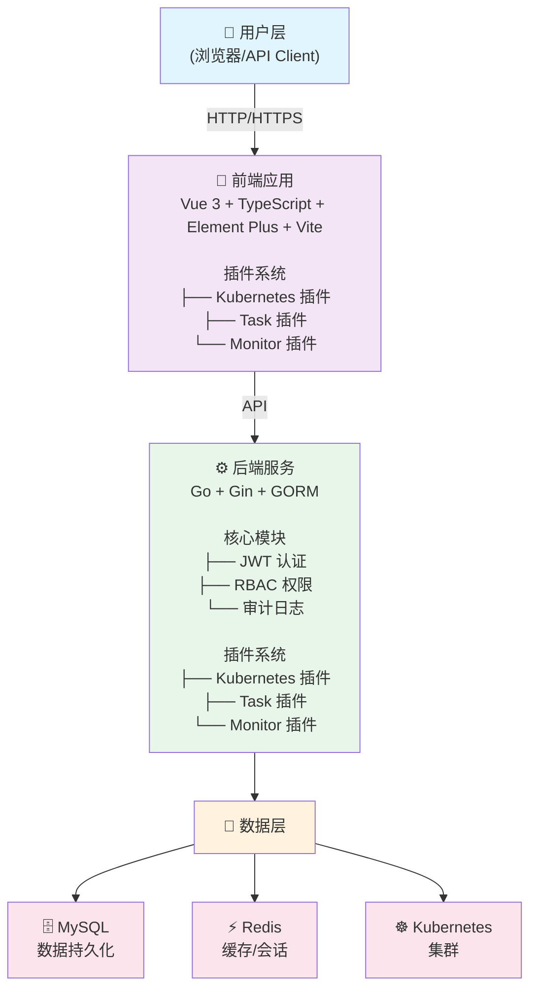
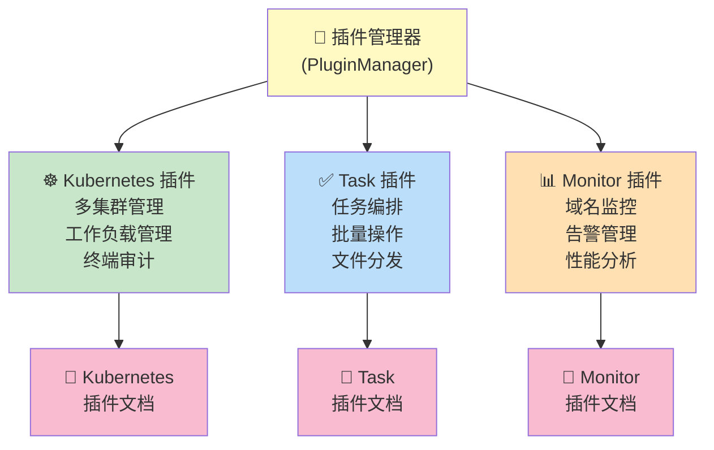

# OpsHub 运维管理平台

<p align="center">
  
</p>

<p align="center">
  <strong>一个现代化、插件化的云原生运维管理平台</strong>
</p>

<p align="center">
  <a href="#功能特性">功能特性</a> •
  <a href="#技术架构">技术架构</a> •
  <a href="#快速开始">快速开始</a> •
  <a href="#部署指南">部署指南</a> •
  <a href="#插件系统">插件系统</a> •
  <a href="#开发指南">开发指南</a>
</p>

---

## 项目简介

OpsHub 是一个功能强大的运维管理平台，采用前后端分离架构，支持多集群 Kubernetes 管理、RBAC 权限控制、资源监控、任务编排等功能。平台采用**插件化架构**设计，支持功能模块的**一键安装与卸载**，可根据实际需求灵活扩展。

### 核心特点

- **插件化架构** - 功能模块以插件形式存在，支持一键安装/卸载，按需加载
- **多集群管理** - 统一管理多个 Kubernetes 集群，支持不同云厂商
- **精细化权限** - 平台级 + Kubernetes 级双重 RBAC 权限控制
- **全链路审计** - 操作日志、终端审计、完整追溯
- **现代化界面** - 基于 Vue 3 + Element Plus 的响应式界面

---

## 功能特性

### 基础功能

| 功能模块 | 描述 |
|---------|------|
| 用户管理 | 用户增删改查、密码重置、状态管理 |
| 角色管理 | 角色定义、权限分配、角色继承 |
| 部门管理 | 组织架构管理、部门层级 |
| 菜单管理 | 动态菜单配置、权限绑定 |
| 操作审计 | 完整的操作日志记录与查询 |

### 插件功能

#### Kubernetes 容器管理插件

提供完整的 Kubernetes 集群管理能力：

| 功能 | 描述                                              |
|-----|-------------------------------------------------|
| 集群管理 | 多集群接入、集群概览、健康检查                                 |
| 节点管理 | 节点列表、资源监控、污点/标签管理                               |
| 命名空间 | 命名空间管理、资源配额                                     |
| 工作负载 | Deployment、StatefulSet、DaemonSet、Job、CronJob 管理 |
| 网络管理 | Service、Ingress、NetworkPolicy 管理                |
| 配置管理 | ConfigMap、Secret 管理                             |
| 存储管理 | PV、PVC、StorageClass 管理                          |
| 访问控制 | ServiceAccount、Role、RoleBinding 管理              |
| 终端审计 | Web Terminal、会话录制与回放                            |
| 应用诊断 | 基于 Arthas 的 Java 应用诊断（线程分析、JVM信息、火焰图等）**未完成**       |
 |集群巡检 | 针对不同集群可一键生成K8S巡检报告 |

#### 任务中心插件

| 功能 | 描述 |
|-----|------|
| 执行任务 | 脚本执行、批量操作 |
| 模板管理 | 任务模板定义与复用 |
| 文件分发 | 批量文件分发到目标主机 |
| 执行历史 | 任务执行记录与日志查看 |

#### 监控中心插件

| 功能 | 描述 |
|-----|------|
| 域名监控 | SSL 证书监控、到期提醒 |
| 告警管理 | 告警规则配置、多渠道通知 |

---

## 技术架构

### 整体架构



### 后端技术栈

| 技术 | 版本 | 描述 |
|-----|------|------|
| Go | 1.21+ | 后端开发语言 |
| Gin | 1.11+ | 高性能 HTTP Web 框架 |
| GORM | 1.31+ | Go 语言 ORM 库 |
| Cobra | 1.10+ | CLI 命令行框架 |
| Viper | 1.21+ | 配置管理 |
| client-go | 0.35+ | Kubernetes Go 客户端 |
| go-redis | 9.17+ | Redis 客户端 |
| jwt-go | 5.3+ | JWT 认证 |
| zap | 1.27+ | 高性能日志库 |
| Swagger | 1.16+ | API 文档生成 |
| WebSocket | - | 实时通信（终端、日志流） |

### 前端技术栈

| 技术 | 版本 | 描述 |
|-----|------|------|
| Vue | 3.5+ | 渐进式 JavaScript 框架 |
| TypeScript | 5.9+ | 类型安全的 JavaScript 超集 |
| Vite | 5.4+ | 下一代前端构建工具 |
| Element Plus | 2.13+ | Vue 3 UI 组件库 |
| Pinia | 3.0+ | Vue 状态管理 |
| Vue Router | 4.6+ | Vue 官方路由 |
| Axios | 1.13+ | HTTP 客户端 |
| xterm.js | 6.0+ | Web 终端模拟器 |
| ECharts | 5.6+ | 数据可视化图表库 |

### 项目结构

```
opshub/
├── cmd/                          # 命令行入口
│   ├── root/                     # 根命令
│   ├── server/                   # 服务启动命令
│   ├── config/                   # 配置命令
│   └── version/                  # 版本信息命令
├── config/                       # 配置文件目录
│   ├── config.yaml               # 主配置文件
│   └── config.yaml.example       # 配置模板
├── internal/                     # 内部代码（核心模块）
│   ├── biz/                      # 业务逻辑层
│   ├── conf/                     # 配置管理
│   ├── data/                     # 数据访问层
│   ├── plugin/                   # 插件系统核心
│   ├── server/                   # HTTP 服务器
│   └── service/                  # 服务层
├── pkg/                          # 公共包
│   ├── error/                    # 错误处理
│   ├── logger/                   # 日志封装
│   ├── middleware/               # 中间件
│   └── response/                 # 响应封装
├── plugins/                      # 插件目录
│   ├── kubernetes/               # Kubernetes 管理插件
│   │   ├── biz/                  # 业务逻辑
│   │   ├── data/                 # 数据层
│   │   ├── model/                # 数据模型
│   │   ├── server/               # HTTP 处理器
│   │   ├── service/              # 服务层
│   │   └── plugin.go             # 插件入口
│   ├── task/                     # 任务中心插件
│   │   ├── model/
│   │   ├── repository/
│   │   ├── server/
│   │   └── plugin.go
│   └── monitor/                  # 监控中心插件
│       ├── model/
│       ├── repository/
│       ├── server/
│       ├── service/
│       └── plugin.go
├── migrations/                   # 数据库迁移脚本
├── docs/                         # Swagger API 文档
├── scripts/                      # 脚本文件
├── web/                          # 前端代码
│   ├── src/
│   │   ├── api/                  # API 请求
│   │   ├── components/           # 公共组件
│   │   ├── plugins/              # 前端插件系统
│   │   │   ├── kubernetes/       # Kubernetes 插件
│   │   │   ├── task/             # 任务插件
│   │   │   ├── monitor/          # 监控插件
│   │   │   ├── manager.ts        # 插件管理器
│   │   │   └── types.ts          # 类型定义
│   │   ├── router/               # 路由配置
│   │   ├── stores/               # Pinia 状态管理
│   │   ├── utils/                # 工具函数
│   │   └── views/                # 页面视图
│   ├── package.json
│   └── vite.config.ts
├── docker-compose.yml            # Docker Compose 配置
├── Dockerfile                    # Docker 构建文件
├── Makefile                      # 构建脚本
├── go.mod
├── go.sum
└── main.go                       # 程序入口
```

---

## 快速开始

### 环境要求

- Go 1.21+
- Node.js 18+
- MySQL 8.0+
- Redis 6.0+

### 默认账号

- 用户名: `admin`
- 密码: `123456`

---

## 部署指南

### 方式一：Docker Compose（推荐）

最简单的部署方式，一键启动所有服务。

```bash
# 1. 克隆项目
git clone https://github.com/ydcloud-dy/opshub.git
cd opshub

# 2. 创建环境变量文件（可选，使用默认配置可跳过）
cp .env.example .env
# 编辑 .env 文件修改配置

# 3. 启动服务
docker-compose up -d

# 4. 查看服务状态
docker-compose ps

# 5. 查看日志
docker-compose logs -f
```

访问地址：
- 前端: http://localhost:3000
- 后端 API: http://localhost:9876
- API 文档: http://localhost:9876/swagger/index.html

停止服务：
```bash
docker-compose down
```

### 方式二：裸部署（手动部署）

适合开发调试或自定义部署需求。

#### 1. 准备数据库

```bash
# 登录 MySQL
mysql -u root -p

# 创建数据库
CREATE DATABASE opshub CHARACTER SET utf8mb4 COLLATE utf8mb4_unicode_ci;
```

#### 2. 配置后端

```bash
# 复制配置文件
cp config/config.yaml.example config/config.yaml

# 编辑配置文件
vim config/config.yaml
```

配置文件示例：
```yaml
server:
  mode: debug                    # debug, release, test
  http_port: 9876
  jwt_secret: "your-secret-key"  # 生产环境请修改

database:
  driver: mysql
  host: 127.0.0.1
  port: 3306
  database: opshub
  username: root
  password: "your-password"

redis:
  host: 127.0.0.1
  port: 6379
  password: ""
  db: 0

log:
  level: info
  filename: logs/app.log
```

#### 3. 启动后端

```bash
# 安装依赖
go mod tidy

# 开发模式运行
go run main.go server

# 或者编译后运行
make build
./bin/opshub server
```

#### 4. 启动前端

```bash
cd web

# 安装依赖
npm install

# 开发模式
npm run dev

# 生产构建
npm run build
```

### 方式三：脚本部署

提供一键部署脚本，适合快速部署到服务器。

```bash
# 下载部署脚本
curl -fsSL https://raw.githubusercontent.com/ydcloud-dy/opshub/main/scripts/install.sh -o install.sh

# 赋予执行权限
chmod +x install.sh

# 执行安装
./install.sh
```

### 方式四：Docker 部署

单独使用 Docker 部署后端服务。

```bash
# 构建镜像
docker build -t opshub:latest .

# 运行容器
docker run -d \
  --name opshub \
  -p 9876:9876 \
  -e OPSHUB_DATABASE_HOST=your-mysql-host \
  -e OPSHUB_DATABASE_PASSWORD=your-password \
  -e OPSHUB_REDIS_HOST=your-redis-host \
  -e OPSHUB_SERVER_JWT_SECRET=your-jwt-secret \
  opshub:latest
```

### 方式五：Kubernetes 部署

适合生产环境的容器化部署。

#### 使用 YAML 部署

```bash
# 创建命名空间
kubectl create namespace opshub

# 创建配置密钥
kubectl create secret generic opshub-secrets \
  --from-literal=db-password=your-db-password \
  --from-literal=jwt-secret=your-jwt-secret \
  -n opshub

# 部署应用
kubectl apply -f deploy/kubernetes/ -n opshub
```

示例 Deployment 文件 (`deploy/kubernetes/deployment.yaml`)：

```yaml
apiVersion: apps/v1
kind: Deployment
metadata:
  name: opshub
  labels:
    app: opshub
spec:
  replicas: 2
  selector:
    matchLabels:
      app: opshub
  template:
    metadata:
      labels:
        app: opshub
    spec:
      containers:
      - name: opshub
        image: opshub:latest
        ports:
        - containerPort: 9876
        env:
        - name: OPSHUB_SERVER_MODE
          value: "release"
        - name: OPSHUB_DATABASE_HOST
          value: "mysql-service"
        - name: OPSHUB_DATABASE_PASSWORD
          valueFrom:
            secretKeyRef:
              name: opshub-secrets
              key: db-password
        - name: OPSHUB_SERVER_JWT_SECRET
          valueFrom:
            secretKeyRef:
              name: opshub-secrets
              key: jwt-secret
        resources:
          requests:
            memory: "256Mi"
            cpu: "100m"
          limits:
            memory: "512Mi"
            cpu: "500m"
        readinessProbe:
          httpGet:
            path: /api/health
            port: 9876
          initialDelaySeconds: 5
          periodSeconds: 10
        livenessProbe:
          httpGet:
            path: /api/health
            port: 9876
          initialDelaySeconds: 15
          periodSeconds: 20
---
apiVersion: v1
kind: Service
metadata:
  name: opshub-service
spec:
  selector:
    app: opshub
  ports:
  - port: 80
    targetPort: 9876
  type: ClusterIP
---
apiVersion: networking.k8s.io/v1
kind: Ingress
metadata:
  name: opshub-ingress
  annotations:
    nginx.ingress.kubernetes.io/proxy-body-size: "100m"
spec:
  rules:
  - host: opshub.example.com
    http:
      paths:
      - path: /
        pathType: Prefix
        backend:
          service:
            name: opshub-service
            port:
              number: 80
```

#### 使用 Helm 部署

```bash
# 添加 Helm 仓库
helm repo add opshub https://charts.opshub.io
helm repo update

# 安装
helm install opshub opshub/opshub \
  --namespace opshub \
  --create-namespace \
  --set database.host=mysql-service \
  --set database.password=your-password \
  --set server.jwtSecret=your-jwt-secret

# 升级
helm upgrade opshub opshub/opshub -n opshub

# 卸载
helm uninstall opshub -n opshub
```

Helm values.yaml 配置示例：

```yaml
replicaCount: 2

image:
  repository: opshub
  tag: latest
  pullPolicy: IfNotPresent

server:
  mode: release
  httpPort: 9876
  jwtSecret: "your-jwt-secret"

database:
  host: mysql-service
  port: 3306
  database: opshub
  username: root
  password: "your-password"

redis:
  host: redis-service
  port: 6379
  password: ""

ingress:
  enabled: true
  className: nginx
  hosts:
    - host: opshub.example.com
      paths:
        - path: /
          pathType: Prefix

resources:
  requests:
    memory: "256Mi"
    cpu: "100m"
  limits:
    memory: "512Mi"
    cpu: "500m"

autoscaling:
  enabled: false
  minReplicas: 2
  maxReplicas: 10
  targetCPUUtilizationPercentage: 80
```

---

## 插件系统

OpsHub 采用插件化架构设计，前后端均实现了完整的插件系统，支持功能模块的动态加载与卸载。

### 插件架构设计



### 后端插件接口

每个后端插件需要实现以下接口：

```go
type Plugin interface {
    // 插件唯一标识
    Name() string

    // 插件描述
    Description() string

    // 插件版本
    Version() string

    // 插件作者
    Author() string

    // 启用插件（初始化资源、数据库表等）
    Enable(db *gorm.DB) error

    // 禁用插件（清理资源）
    Disable(db *gorm.DB) error

    // 注册 API 路由
    RegisterRoutes(router *gin.RouterGroup, db *gorm.DB)

    // 获取菜单配置
    GetMenus() []MenuConfig
}
```

### 前端插件接口

每个前端插件需要实现以下接口：

```typescript
interface Plugin {
  name: string
  description: string
  version: string
  author: string

  // 安装插件
  install: () => void | Promise<void>

  // 卸载插件
  uninstall: () => void | Promise<void>

  // 获取菜单配置
  getMenus?: () => PluginMenuConfig[]

  // 获取路由配置
  getRoutes?: () => PluginRouteConfig[]
}
```

### 一键安装/卸载

#### 通过管理界面操作

1. 登录系统后进入「系统管理」-「插件管理」
2. 查看可用插件列表
3. 点击「安装」按钮安装插件
4. 点击「卸载」按钮卸载插件
5. 刷新页面使配置生效

#### 通过 API 操作

```bash
# 获取所有插件
GET /api/v1/plugins

# 启用插件
POST /api/v1/plugins/{name}/enable

# 禁用插件
POST /api/v1/plugins/{name}/disable
```

### 开发新插件

#### 后端插件开发

1. 在 `plugins/` 目录下创建插件目录：

```bash
plugins/
└── myplugin/
    ├── biz/           # 业务逻辑
    ├── model/         # 数据模型
    ├── server/        # HTTP 处理器
    │   ├── handler.go
    │   └── router.go
    ├── service/       # 服务层
    └── plugin.go      # 插件入口
```

2. 实现插件入口 (`plugin.go`)：

```go
package myplugin

import (
    "github.com/gin-gonic/gin"
    "gorm.io/gorm"
    "github.com/ydcloud-dy/opshub/internal/plugin"
)

type Plugin struct {
    db *gorm.DB
}

func New() *Plugin {
    return &Plugin{}
}

func (p *Plugin) Name() string        { return "myplugin" }
func (p *Plugin) Description() string { return "我的自定义插件" }
func (p *Plugin) Version() string     { return "1.0.0" }
func (p *Plugin) Author() string      { return "Your Name" }

func (p *Plugin) Enable(db *gorm.DB) error {
    p.db = db
    // 自动迁移数据库表
    return db.AutoMigrate(&model.MyModel{})
}

func (p *Plugin) Disable(db *gorm.DB) error {
    return nil
}

func (p *Plugin) RegisterRoutes(router *gin.RouterGroup, db *gorm.DB) {
    server.RegisterRoutes(router, db)
}

func (p *Plugin) GetMenus() []plugin.MenuConfig {
    return []plugin.MenuConfig{
        {
            Name: "我的功能",
            Path: "/myplugin",
            Icon: "Star",
            Sort: 200,
        },
    }
}
```

3. 在主程序中注册插件：

```go
// cmd/server/server.go
import "github.com/ydcloud-dy/opshub/plugins/myplugin"

pluginManager.Register(myplugin.New())
```

#### 前端插件开发

1. 在 `web/src/plugins/` 目录下创建插件目录：

```bash
web/src/plugins/
└── myplugin/
    └── index.ts
```

2. 实现插件入口：

```typescript
import type { Plugin, PluginMenuConfig, PluginRouteConfig } from '../types'
import { pluginManager } from '../manager'

class MyPlugin implements Plugin {
  name = 'myplugin'
  description = '我的自定义插件'
  version = '1.0.0'
  author = 'Your Name'

  async install() {
    console.log('MyPlugin 安装中...')
  }

  async uninstall() {
    console.log('MyPlugin 卸载中...')
  }

  getMenus(): PluginMenuConfig[] {
    return [
      {
        name: '我的功能',
        path: '/myplugin',
        icon: 'Star',
        sort: 200,
        hidden: false,
        parentPath: '',
      },
    ]
  }

  getRoutes(): PluginRouteConfig[] {
    return [
      {
        path: '/myplugin',
        name: 'MyPlugin',
        component: () => import('@/views/myplugin/Index.vue'),
        meta: { title: '我的功能' },
      },
    ]
  }
}

const plugin = new MyPlugin()
pluginManager.register(plugin)
export default plugin
```

3. 在主入口注册插件：

```typescript
// web/src/plugins/index.ts
import './myplugin'
```

---

## 环境变量

支持通过环境变量覆盖配置文件，环境变量前缀为 `OPSHUB_`。

| 环境变量 | 描述 | 默认值 |
|---------|------|--------|
| `OPSHUB_SERVER_MODE` | 运行模式 (debug/release/test) | debug |
| `OPSHUB_SERVER_HTTP_PORT` | HTTP 服务端口 | 9876 |
| `OPSHUB_SERVER_JWT_SECRET` | JWT 签名密钥 | - |
| `OPSHUB_DATABASE_HOST` | MySQL 地址 | 127.0.0.1 |
| `OPSHUB_DATABASE_PORT` | MySQL 端口 | 3306 |
| `OPSHUB_DATABASE_DATABASE` | 数据库名 | opshub |
| `OPSHUB_DATABASE_USERNAME` | 数据库用户名 | root |
| `OPSHUB_DATABASE_PASSWORD` | 数据库密码 | - |
| `OPSHUB_REDIS_HOST` | Redis 地址 | 127.0.0.1 |
| `OPSHUB_REDIS_PORT` | Redis 端口 | 6379 |
| `OPSHUB_REDIS_PASSWORD` | Redis 密码 | - |
| `OPSHUB_LOG_LEVEL` | 日志级别 | info |

---

## 开发指南

### 本地开发

```bash
# 后端开发
go run main.go server

# 前端开发
cd web && npm run dev
```

### 常用命令

```bash
# 构建后端
make build

# 运行测试
make test

# 代码格式化
make fmt

# 代码检查
make lint

# 生成 Swagger 文档
make swagger

# 清理构建产物
make clean
```

### API 文档

启动服务后访问 Swagger UI：
```
http://localhost:9876/swagger/index.html
```

### 数据库迁移

项目启动时会自动执行数据库迁移：
- 创建/更新数据库表结构
- 初始化默认数据（管理员账号、默认角色、默认菜单等）

---

## 常见问题

### 1. 数据库连接失败

检查 MySQL 服务是否启动，配置是否正确：
```bash
mysql -u root -p -h 127.0.0.1 -P 3306
```

### 2. Redis 连接失败

检查 Redis 服务是否启动：
```bash
redis-cli ping
```

### 3. 前端无法访问后端 API

检查跨域配置和后端服务是否正常启动。

### 4. Kubernetes 集群连接失败

确保 kubeconfig 配置正确，集群 API Server 可访问。

### 5. 插件安装后菜单不显示

刷新页面，检查浏览器控制台是否有错误信息。

---

## 贡献指南

欢迎提交 Issue 和 Pull Request！

1. Fork 本仓库
2. 创建特性分支 (`git checkout -b feature/AmazingFeature`)
3. 提交更改 (`git commit -m 'Add some AmazingFeature'`)
4. 推送到分支 (`git push origin feature/AmazingFeature`)
5. 提交 Pull Request

---

## 许可证

本项目采用 [MIT License](LICENSE) 开源许可证。

---

## 联系方式

- Issue: [GitHub Issues](https://github.com/ydcloud-dy/opshub/issues)
- Email: support@opshub.io

---

<p align="center">
  Made with ❤️ by OpsHub Team
</p>
